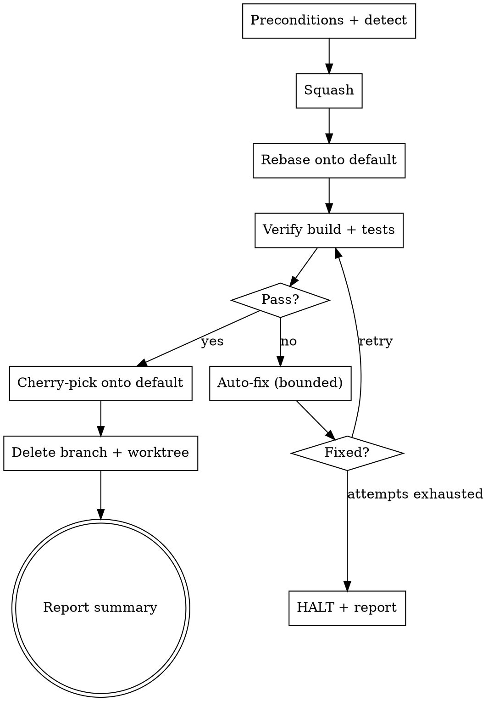

# Land

Integrate the current feature branch into the repository's default branch, locally
and cleanly: **squash → rebase → verify → cherry-pick → clean up**.

Runs **fully autonomously while each step succeeds**. It stops only to auto-fix a
failing build/test (then continues), or to halt-and-report on an unrecoverable
failure. **It never pushes** — landing is entirely local.

## When to use

- "Land this branch." / "Land my work onto main."
- A feature branch is done, tests were passing, and you want it collapsed into a
  clean commit on the default branch.
- Works from either a **linked git worktree** or a **single shared checkout** —
  the skill detects which and adapts.

## When NOT to use

- You are on the default branch itself (nothing to land — abort).
- The work is not finished, or you want to keep the granular commit history.
- You want the result pushed to a remote — this skill deliberately never pushes.

## The pipeline



## Step 1 — Preconditions & detection

Establish state before any destructive action. **If any precondition fails, halt and report — touch nothing.**

```bash
git rev-parse --is-inside-work-tree              # must be a repo
FEATURE=$(git symbolic-ref --quiet --short HEAD) # current branch; empty => detached HEAD, abort
```

Detect the default branch (first that resolves):
```bash
# 1) ask the remote's HEAD (strip the leading "origin/"):
git symbolic-ref --quiet --short refs/remotes/origin/HEAD
# 2) fallback — first local branch that exists, in order:
for b in main master trunk; do git show-ref --verify --quiet "refs/heads/$b" && echo "$b" && break; done
```

- **Abort if `FEATURE` equals the default branch.**
- Refresh remote refs but do **not** pull — rebase onto **local** default as-is:
  ```bash
  git fetch --all --prune
  ```
- **Dirty check** — abort if the working tree has uncommitted changes:
  ```bash
  git status --porcelain     # must be empty
  ```

Detect topology (drives Steps 5–6):
```bash
[ "$(git rev-parse --git-dir)" != "$(git rev-parse --git-common-dir)" ] && echo "linked worktree"
git worktree list --porcelain    # find which worktree (if any) has the default branch checked out
```
Record `MAIN_WT` = the worktree path where the default branch is checked out (may be
none in a single checkout where default isn't currently out). Use the **canonical**
path exactly as `git worktree list --porcelain` prints it (e.g. macOS reports
`/private/var/…`, not the `/var/…` symlink) — mismatched paths break `worktree remove`.

## Step 2 — Squash

```bash
BASE=$(git merge-base <default> HEAD)
git rev-list --count $BASE..HEAD        # commits ahead; if 0, abort ("nothing to land")
git log --format='%B' $BASE..HEAD       # CAPTURE original messages BEFORE reset
git log -20 --format='%s'               # learn the repo's commit-subject style
```

Synthesize a commit message from the captured messages + the branch diff, matching
the repo's style. **When the messages and the diff disagree** (e.g. a `wip fix typo`
message with no typo fix in the diff), **describe what the diff actually does** — the
diff is ground truth, the messages are hints. **No attribution trailers. No approval
prompt.** Then:

```bash
git reset --soft $BASE
git commit -m "<synthesized message>"
```

Default to **one** commit. Split into a small series (`git reset --soft` then multiple
`git commit`s of staged subsets) **only** when the diff spans clearly distinct,
unrelated concerns.

## Step 3 — Rebase onto the default branch

```bash
git rebase <default>
```
A **no-op rebase** (`Current branch <feature> is up to date`) is expected and fine
when the default branch hasn't advanced past the merge-base — that is success, not a
failure. On conflict: attempt to resolve autonomously, `git add` the resolutions,
`git rebase --continue`. If genuinely unresolvable, `git rebase --abort` **only if you
cannot make progress**, then halt and report the conflicted files — leave the branch
recoverable.

## Step 4 — Verify (build + tests)

Determine commands **in this order**:
1. **Docs** — `CLAUDE.md`, `AGENTS.md`, `README` for documented build/test commands.
2. **Auto-detect** — `package.json` scripts, `Makefile`, `go.mod`, `Cargo.toml`, `pyproject.toml`, etc.
3. **Ask** the user only if still undetermined.

Run build, then tests. **The bar is zero errors AND zero warnings.**

On failure: **attempt to auto-fix** (use the `superpowers:systematic-debugging`
skill), then **re-verify**. Bound this to ~3 fix attempts. If still failing, **halt and
report** — the default branch is never touched until verification is clean.

## Step 5 — Cherry-pick onto the default branch

After the rebase, the `<FEATURE>` branch is `default-tip + your squashed commit(s)`.
Define the range with an **explicit branch ref**, never `HEAD`:

```
RANGE = <default>..<FEATURE>      # e.g. main..feature
```

> **Critical:** do NOT write `<default>..HEAD`. In the worktree case the cherry-pick
> runs under `git -C "$MAIN_WT"`, where `HEAD` resolves to the *default* branch, so
> `<default>..HEAD` is an **empty range** — it cherry-picks nothing, and Step 6 then
> deletes the branch, **destroying the work.** Always use the `<FEATURE>` ref.

- **Single shared checkout** (default not checked out elsewhere):
  ```bash
  git switch <default>
  git cherry-pick <default>..<FEATURE>       # e.g. main..feature
  ```
- **Worktree case** (default is checked out in `MAIN_WT`): don't switch here — run in
  that worktree, and **abort if it is dirty**:
  ```bash
  git -C "$MAIN_WT" status --porcelain       # must be empty
  git -C "$MAIN_WT" cherry-pick <default>..<FEATURE>
  ```

## Step 6 — Clean up

Delete the source branch and, if it was a linked worktree, remove the worktree. **You
cannot delete a branch or worktree while it is checked out where you are standing.**
Using the `git -C "$MAIN_WT" …` form (rather than shell-`cd`) satisfies this — you
operate on the branch/worktree from the *outside*. Once you remove the feature
worktree, stop running any command with your shell inside it (it no longer exists).

- **Single checkout** (you switched to default in Step 5):
  ```bash
  git branch -D <FEATURE>
  git rev-parse <default>            # new default SHA, for the report
  ```
- **Worktree case** (operate via `MAIN_WT`; never delete the worktree from inside it):
  ```bash
  git -C "$MAIN_WT" worktree remove <feature-worktree-path>
  git -C "$MAIN_WT" branch -D <FEATURE>
  git -C "$MAIN_WT" rev-parse <default>   # new default SHA, for the report
  ```
  If `worktree remove` complains about a path mismatch, use the **canonical** path from
  `git worktree list --porcelain` (e.g. macOS reports `/private/var/…` for `/var/…`).

**Report** a summary: what landed, the new default-branch SHA (from the `rev-parse`
above), and what was cleaned up.

## Common mistakes

- **Cherry-picking `<default>..HEAD` instead of `<default>..<FEATURE>`** — under
  `git -C "$MAIN_WT"`, `HEAD` is the default branch, so the range is empty and the
  work is silently dropped before cleanup deletes it. Always use the explicit
  `<FEATURE>` ref.
- **Capturing commit messages after `git reset --soft`** — they're gone. Read
  `git log $BASE..HEAD` in Step 2 *before* resetting.
- **Trusting a misleading commit message over the diff** — synthesize from what the
  diff actually changed; treat the old messages as hints only.
- **`git switch <default>` when default is checked out in another worktree** — git
  refuses. Use `git -C "$MAIN_WT" …` instead.
- **Deleting the current worktree/branch from inside it** — operate via
  `git -C "$MAIN_WT"`; never `cd` into the worktree you intend to remove.
- **Assuming `$MAIN_WT` is set in a single checkout** — it may be empty; use the plain
  (non-`-C`) git form on that path.
- **Skipping the dirty-tree checks** — both the feature tree (Step 1) and the default
  worktree (Step 5) must be clean, or you corrupt someone's uncommitted work.
- **Touching the default branch before verification passes** — never. Verify on the
  rebased feature branch first.
- **Pushing** — this skill never pushes. Landing is local only.
- **Treating a warning as acceptable** — zero warnings is part of "verified."
